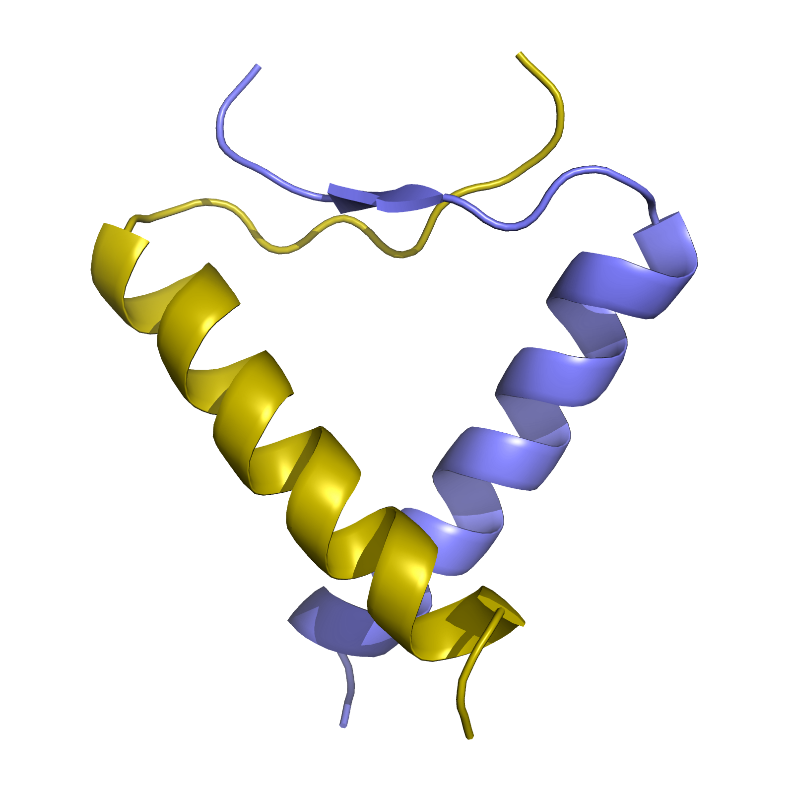
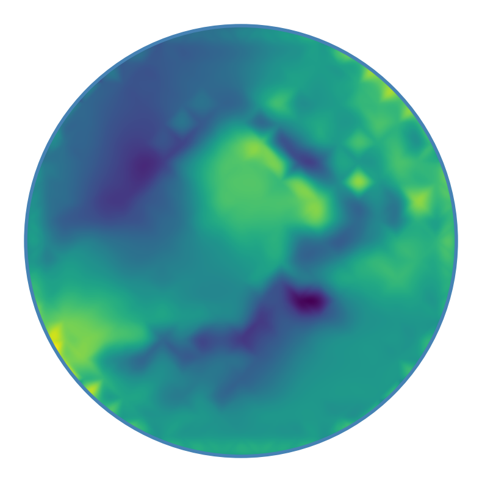
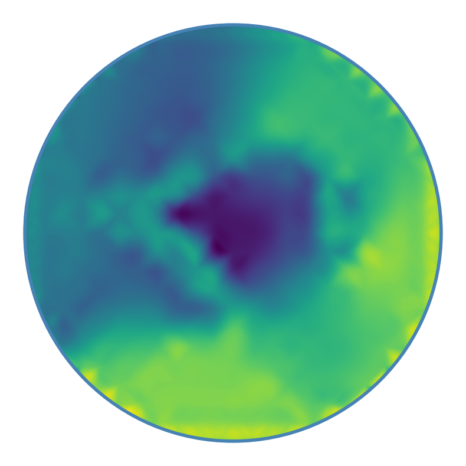

# Zernike2D

We report a minimal reproducible example of the working protocol described in _2D Zernike polynomial expansion: Finding the protein-protein binding regions_, available <a href="https://www.sciencedirect.com/science/article/pii/S2001037020305183">here</a>.

To perform the entire procedure starting from a pdb and arriving at the binding propensity calculation, it is necessary to obtain the molecular surface area of the pdb; to do this we use the <a href="https://www.cgl.ucsf.edu/Overview/software.html#dms">dms software</a>.

To calculate the 2D Zernike descriptors we have developed the python package `zepyros`; if you are interested, you can read the documentation at <a href="https://matmi8.github.io/zepyros/index.html">https://matmi8.github.io/zepyros/index.html</a>


## Set environment
For this tutorial we use `1a1u.pdb`
<p align="center">
    
</p>

Clone this repository and create within it a `tutorial/` folder. 
It is also recommended to create a virtual environment and install the required packages. In the working directory:
```bash
python3 -m venv venv
. venv/bin/activate
```

Once the virtual environment is activated:
```bash
pip install -r requirements.txt
```

Your work directory should look like the following
```bash
.
├── get_binding_propensity.py
├── get_molecular_surface.py
├── get_zernike2d_invariants.py
├── figures
│   └── 1a1u.png
├── input_files
│   ├── 1a1u_A.csv
│   ├── 1a1u_A.dms
│   ├── 1a1u_A.pdb
│   ├── 1a1u_C.csv
│   ├── 1a1u_C.dms
│   └── 1a1u_C.pdb
├── output_files
│   └── 1a1u_A_bp.csv
│   ├── 1a1u_A_up_coeff.csv
│   ├── 1a1u_A_up_coeff.png
│   ├── 1a1u_A_up_disk.png
│   ├── 1a1u_C_bp.csv 
│   ├── 1a1u_C_down_coeff.csv
│   ├── 1a1u_C_down_coeff.png
│   └── 1a1u_C_down_disk.png
├── README.md
├── requirements.txt
├── tutorial
└── venv
```

## DMS surface
If you have the dms software installed you can run the procedure starting from the `1a1u_A.pdb` and `1a1u_C.pdb` files. 

If you do not have dms installed, however, you can skip this step and use the `1a1u_A.csv` and `1a1u_C.csv` files in the next one.

**NOTE**: please use a pdb that contains non-empty chains

The `get_molecular_surface.py` script calculates the molecular surface by dms and then manipulates the output file to obtain a `.csv` file for use in the next steps.

The script takes as input:
- the name of the pdb file (ex: `1a1u_A.pdb`)
- the input full path to the file
- the output full path of the produced files (ex: `1a1u_A.dms` and `1a1u_A.csv`)
- an optional `-a` flag to calculate the molecular surface area of all atoms in the pdb, including water or ions; we recommend using this flag with awareness (e.g., in case of protein + ligand complex)

If you are working in the zernike2d folder you can run

```bash
python get_molecular_surface.py -pdb 1a1u_A.pdb -i ./input_files/ -o ./tutorial/
python get_molecular_surface.py -pdb 1a1u_C.pdb -i ./input_files/ -o ./tutorial/
```

Now you should have files `1a1u_A.dms`, `1a1u_A.csv` and `1a1u_C.dms`, `1a1u_C.csv` in the `tutorial` folder.


## Zernike 2D descriptors
If you followed the previous step you have files `1a1u_A.dms`, `1a1u_A.csv` and `1a1u_C.dms`, `1a1u_C.csv` in the `tutorial` folder. The same files are in the `input_path` folder.

The script `get_zernike2d_invariants.py` computes Zernike invariants on a 6Å patch centered at the point with index 0 in the `.csv` file. In particular it takes as input:
- the name of the `.csv` file (e.g., `1a1u_A.csv`)
- the input path of the `.csv` file
- the output path

Three files will be saved in the output path:
- `.csv` with Zernike invariants for a development at order 20 (121 elements)
- a plot of the invariants
- a plot of the reconstructed 2d Zernike patch

You can run this script from the root directory
```bash
python get_zernike2d_invariants.py -sf 1a1u_A.csv -i ./input_files/ -o ./tutorial/ -v 1
python get_zernike2d_invariants.py -sf 1a1u_C.csv -i ./input_files/ -o ./tutorial/ -v -1
```

In the `tutorial/` folder you will find the produced files which are the same files in the `output_files/` folder.

<p align="center">
  
   
</p>


## Binding Propensity
To calculate binding propensity we need the Zernike descriptors for each point on the surface. Since the calculation is very time-consuming, we can sample the surface by taking every tenth point.

The script `get_binding_propensity.py` calculates these descriptors for the two surfaces `1a1u_A.csv` and `1a1u_B.csv` and then calculates the binding propensity. It takes as input:
- the surface1 `<path>/<file1>.csv`
- the surface2 `<path>/<file2>.csv`
- the output path

Two `.csv` will be saved in the output file with 5 columns (`x, y, z, color, bp`) and number of rows equal to the number of points sampled on the respective surface.

The `bp` column indicates the binding propensity for each point on the surface, defined as the minimal distance between Zernike descriptors associated to a point of surface _A_ and all points belonging to the surface _C_ and viceversa.

Again from the usual directory, you can run:
```bash
python get_binding_propensity.py -sf1 ./input_files/1a1u_A.csv -sf2 ./input_files/1a1u_C.csv -o ./tutorial/
```

**NOTE**: the execution will take several hours. If you don't want to wait, you can use the files `1a1u_A_bp.csv` and `1a1u_C_bp.csv` in the output_files folder

When finished you will find the files `1a1u_A_bp.csv` and `1a1u_C_bp.csv` in the `tutorial/` folder.


### Smooth Binding Propensity
The last part of the analysis is to smooth the binding propensity and calculate the AUC and ROC curves, comparing the real and the predicted _binding site propensity_ groups.

To do this we use the `R` script `binding_propensity_analysis.R` so that we can take advantage of the `ROCR` package. The script takes as input the paths to the two files produced at the previous step

```bash
Rscript binding_propensity_analysis.R ./tutorial/1a1u_A_bp.csv ./tutorial/1a1u_C_bp.csv
```
AUC values for the two proteins will be printed on the screen:
```bash
[1] "The AUC of the first protein is: 0.73"
[1] "The AUC of the second protein is: 0.69"
```

## Cite
If you use `Zenike2D` in a scientific publication, please cite:

Edoardo Milanetti, Mattia Miotto, Lorenzo Di Rienzo, Michele Monti, Giorgio Gosti, Giancarlo Ruocco (2021). _2D Zernike polynomial expansion: Finding the protein-protein binding regions_. In
Computational and Structural Biotechnology Journal (Vol 19, Pages 29-36).\
https://doi.org/10.1016/j.csbj.2020.11.051

```
@article{MILANETTI202129,
title = {2D Zernike polynomial expansion: Finding the protein-protein binding regions},
journal = {Computational and Structural Biotechnology Journal},
volume = {19},
pages = {29-36},
year = {2021},
issn = {2001-0370},
doi = {https://doi.org/10.1016/j.csbj.2020.11.051},
url = {https://www.sciencedirect.com/science/article/pii/S2001037020305183},
author = {Edoardo Milanetti and Mattia Miotto and Lorenzo {Di Rienzo} and Michele Monti and Giorgio Gosti and Giancarlo Ruocco}
}
```